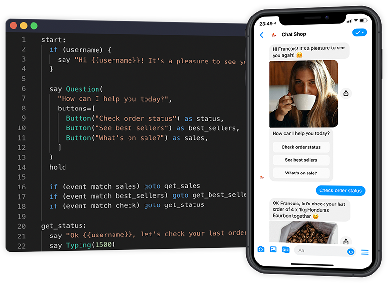

# Bot Maker

Tools for Building Bot with small scripts which can fully control the conversation logit.

## Features

* Use Third-party NLU service which means that you can test it with your own NLU models.
* Support default NLU tools which can help you train & run you nlu server
* Support Customized QA modules to handle the faq problem.
* Support Customized Chitchat modules
* Support Customized simple Task Script to get full control about your conversion with users
* default support python-wechaty, which can help you get in touch with wechat, dingtalk, whatsapp, and so on ...
* ...

## Quick Start

### Installtion

```shell
pip install bot-maker
```

### Start bot

```python
from asyncio
from bot_maker import Bot, FAQ, DocumentQA, DocVQA, TaskOriented

async def run():
    bot = Bot()
    bot.use([
        FAQ(corpus='./faq.json'),
        DocumentQA(corpus='http://docs.readthedocs.io'),
        TaskOriented(
            scripts=[
                BookTrainTicket()
            ]
        )
    ])
    await bot.start()

asyncio.run(run())
```

## Task Script 

```python
from bot_maker.maker import Task


class SalesTask(Task):

    @staticmethod
    def trigger_intent() -> str:
        return 'Sales'

    async def check(self):
        username = self.state.get('username')
        await self.bot.say(f'OK {username}, let"s check your last order')

    async def conversation(self):
        username = self.state.get('username')
        if username:
            await self.bot.say(f"Hi {username}! It's a pleasure to see you.", say_once=True)
        self.bot.say('How can I help you today?')
        
        message = await self.user.wait_message()
        if message.intent.intent == 'sales':
            await self.sales()
        elif message.intent.intent == 'best_sellers':
            await self.best_sellers()
        elif message.intent.intent == 'check':
            await self.check()
```

## BluePrint



## Quick Start

### Installation

```shell
pip install bot-maker
```

### Write Task Script

```python

```


## Creators

- [@wj-Mcat](https://github.com/wj-Mcat) - Jingjing WU (吴京京)

## Copyright & License

- Code & Docs © [@wj-Mcat](https://github.com/wj-Mcat)
- Code released under the Apache-2.0 License
- Docs released under Creative Commons
